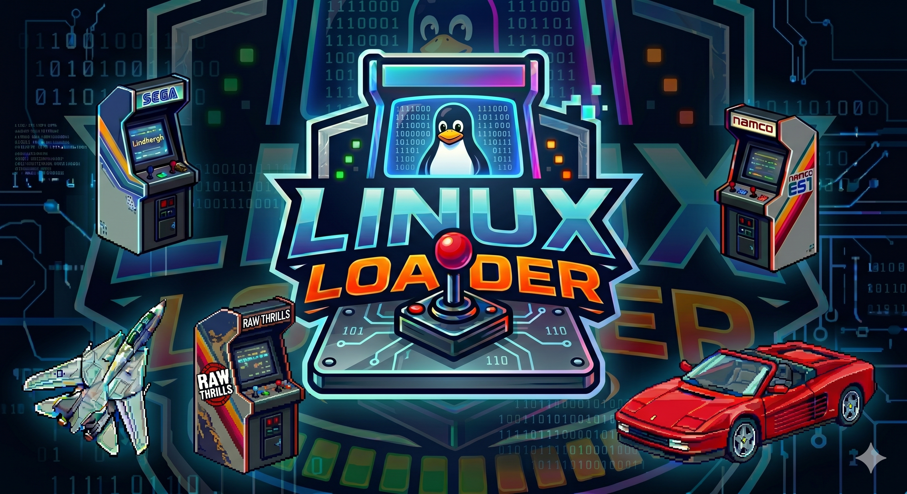

<p align="center">
  
</p>

# Pacloader (5DX+)

This project is an actually forked from Pacloader. The main goal is to run all the SEGA Lindbergh games in Linux and Windows plus, in the future, other Arcade systems such as Namco N2 / ES1 and Raw Thrills.

## 📚 Documentation

For detailed information on configuration and controls, please see the following guides:

- [**🚀 Linux Guide**](docs/guide-linux.md): Information on supported games, known issues, and general configuration for Linux.
- [**🎮 Windows Guide**](docs/guide-windows.md): Information on supported games, known issues, and general configuration for Windows.
- [**🎮 Controls Guide**](docs/Controls-Guide.pdf): A detailed guide on how to customize your controls using the `controls.ini` file.

If you'd like to support the development work of this loader, see early development builds or get support from the authors please consider [becoming a patreon here](https://www.patreon.com/c/LinuxLoader).

If you need any help please ask the community in the [arcade community discord](https://arcade.community). Please only submit issues if they are bugs with the software, ask in the arcade community discord if you're not sure if it's a bug or you're not setting something up properly!

## Building & Running

### Linux

In order to build the loader in Linux you will need to run the following commands. We recommend Ubuntu 22.04 LTS, but it will run in almost any modern distro using the AppImage.  
Please note other dependencies might be required to run games (see the [guide](docs/guide-linux.md)).


```shell
git clone git@github.com:lindbergh-loader/linuxloader.git
cd linuxloader
./scripts/appimage/install-packages.sh
./scripts/appimage/build-deps.sh
make linux
```

This loader in Linux will need access to the input devices and serial devices on your computer. You should add your user account to the following groups and then _restart your computer_.

```shell
sudo usermod -a -G dialout,input $USER
```

Then you can copy the contents of the build-linux directory to any folder you want and run `./linuxloader -g /path/to/your/game` for the game, or `./linuxloader -g /path/to/your/game -t` for test mode. Please note you might need to set the game executable as "executable" using `chmod +x`.
Or run `./linuxloader --help` to see the available options.

Example:
```shell
cp -a build-linux/* /home/<user>/emulators/linuxloader
cd /home/<user>/emulators/linuxloader
./linuxloader -g /path/to/your/game 
```

### Windows

To build this project in Windows you can use the following script.

```shell
.\scripts\windows\windows-build.bat
```
The script will download Msys, install the required packages and compile the project. After this it will create a .exe file in the build-win32 directory. You can copy this file along with all the required.dll files to any folder you want and run it.


If you'd like to change game settings, you can create a file named `linuxloader.ini` in the same directory as the game executable and copy the default configuration file to it. For example:

```shell
./linuxloader --create config /path/to/your/game-folder
```

Please take a look at the configuration options, supported games and known issues in the [guide](docs/guide-windows.md).


***NOTE*** For configuration files, check the corresponding guide for the operating system you're using: [Linux](docs/guide-linux.md) or [Windows](docs/guide-windows.md).

## License

<p xmlns:cc="http://creativecommons.org/ns#" xmlns:dct="http://purl.org/dc/terms/"><a property="dct:title" rel="cc:attributionURL" href="https://github.com/lindbergh-loader/">Linux Loader</a> by <a rel="cc:attributionURL dct:creator" property="cc:attributionName" href="https://github.com/lindbergh-loader/">Linux Loader Development Team</a> is licensed under <a href="https://creativecommons.org/licenses/by-nc-sa/4.0/?ref=chooser-v1" target="_blank" rel="license noopener noreferrer" style="display:inline-block;">Creative Commons Attribution-NonCommercial-ShareAlike 4.0 International</a></p>

Our project is open source, and our primary goal is to preserve and maintain arcade machines, ensuring they continue to operate in arcades. We encourage individuals to use the information provided for their own open source projects and contribute to the development of the loader to improve it for the benefit of the community. However, we do not permit the use of any of our code in pay-to-play/subscription/commercial ventures without prior consent from the Linux Loader Development Team. If we become aware of any such use, we reserve the right to take legal action.

## References and libraries

This project has been built using the following libraries:

- [minhook](https://github.com/TsudaKageTora/minhook)
- [libxdiff](http://www.xmailserver.org/xdiff-lib.html)
- [ELFIO](https://github.com/serge1/ELFIO)
- [SDL3](https://github.com/libsdl-org/SDL)
- [glad](https://github.com/Dav1dde/glad)
- [FAudio](https://github.com/faudio/faudio)

## Thanks

This project has been built by referencing various earlier projects and would like to extend it's thanks to everyone that has contributed to the Arcade Scene.

## Takedown Notices

The Linux Loader Development Team respects intellectual property rights and is committed to ensuring that no copyrighted material is shared without proper authorization. If you believe that we are infringing on your intellectual property or have any concerns regarding our activities, please contact us in the [arcade community discord](https://arcade.community). We are more than happy to address any issues and discuss them further.
